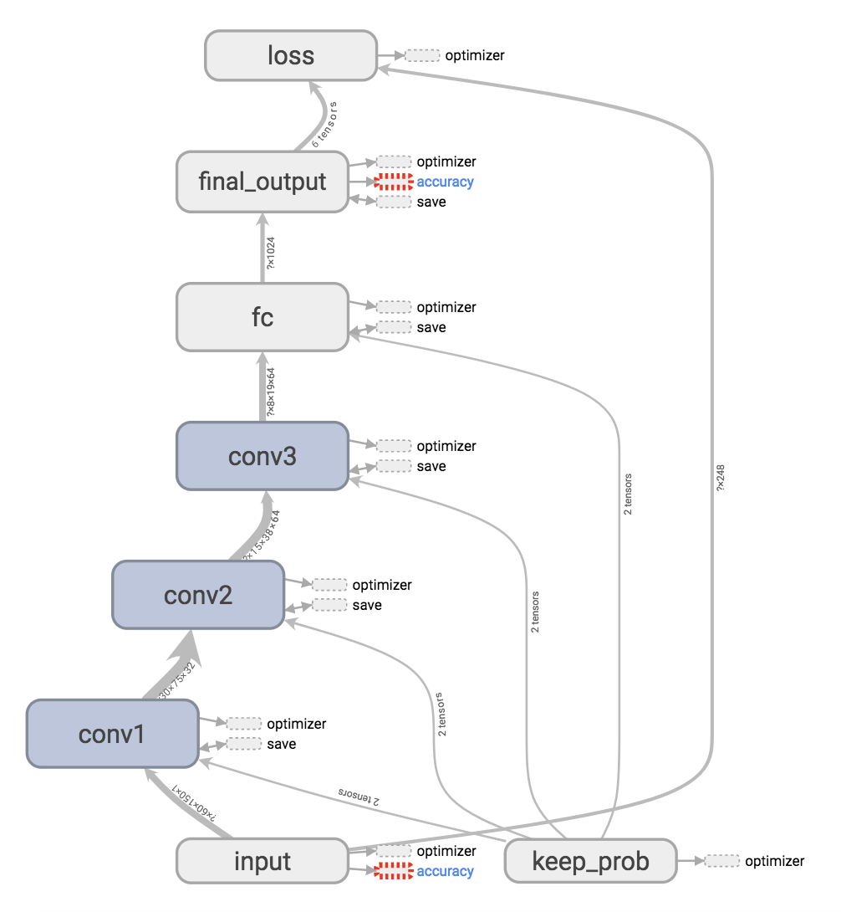
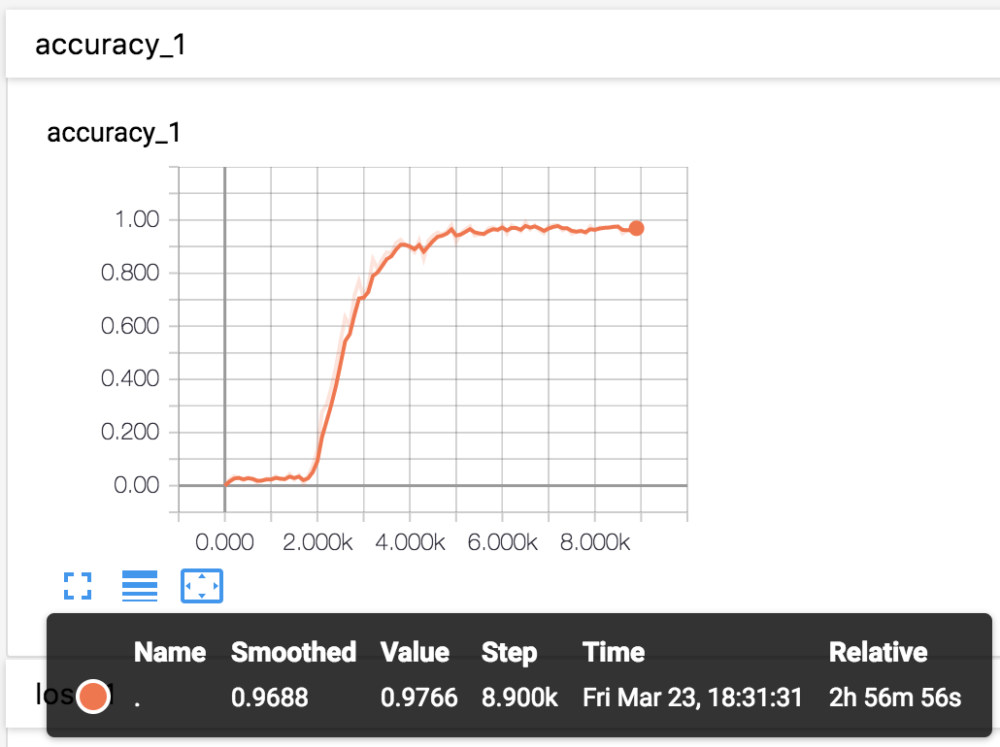
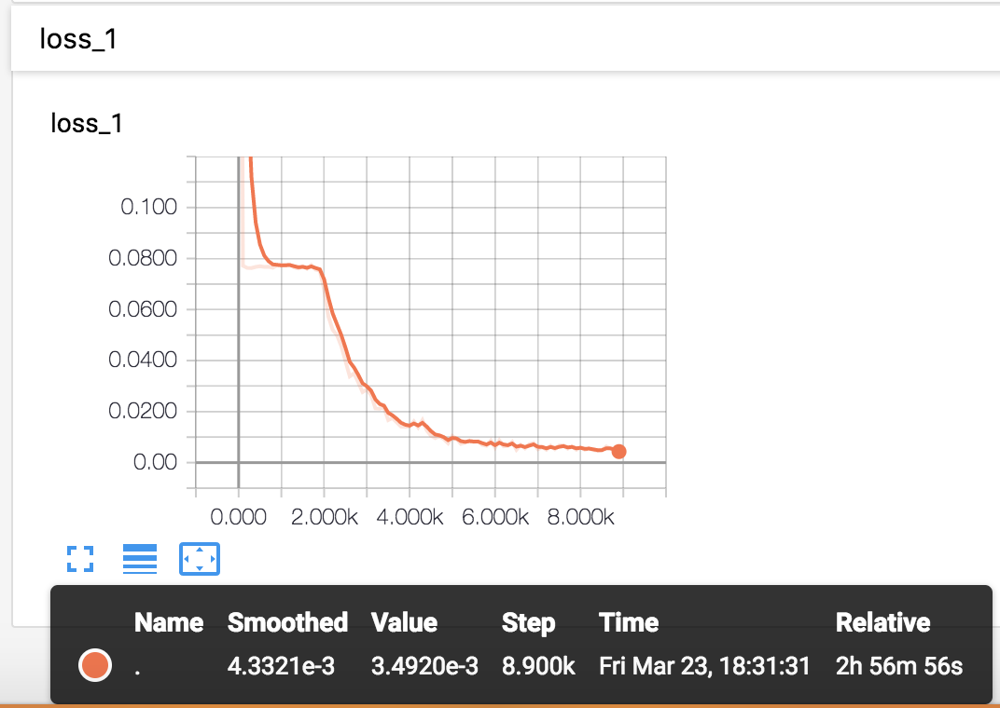

最近在爬知乎的数据，遇到了验证码，就想使用TensorFlow的CNN训练一个能自动识别验证码的模型，说干就干！  

### 预备知识
1. Python3
2. PIL库和numpy库
3. TensorFlow
4. CNN(卷积神经网络)

### 分析
如果你爬过知乎，你会遇到两种验证码：细字体和粗字体。  
  
  
  

如果把两种验证码混合放到同一个神经网络中训练的话，收敛会比较慢，需要的样本量就比较大，然而我并没有很多样本，只能人工打码或者买打码服务去获取样本。所以我们可以先训练一个分类器，将两种验证码区分开，再分别去训练识别，这样需要的样本量就会少很多了！**机智如我！**

### 样本获取
**请看文末。**（只提供了10万张细字体的样本，如果你真的感兴趣，请你自己想办法撸粗字体的样本）

### 如何运行
1. 把你的验证码样本按照细、粗字体分开分别放到`samples`目录下的`normal_captcha_base64.txt`和`bold_captcha_base64.txt`文件中。
2. 训练分类模型，到`classify`目录下运行`model.py`文件，我跑了300多步准确率就达到1了。
3. 训练预测模型，到`predict`目录下运行`model.py`文件`start_train(clazz=0)`的参数为0表示训练细字体的模型，为1表示训练粗字体的模型。训练结束后会分别生成两个目录用来保存训练的网络和参数。
4. 在项目根目录下的`__init__.py`中，恢复分类模型和预测模型，导出`predict`预测函数。
5. 其他模块从`__init__.py`中导入`predict`函数，传入base64编码的图片字符串，执行得到预测结果。
6. Boom！想干嘛你就可以干嘛了！

### CNN
上面几个网络模型都是类似的，都是使用TensorFlow构建了一个简单的卷积神经网络，包含一个输入层、三个卷积层+池化层和最后一个全连接层，关于CNN的具体原理大家可以Google查一查，数据科学家N多年总结出来也不是几句话能说清楚的。  
  
使用**TensorBoard**可以可视化训练的相关情况。  
给大家看一下我训练细字体的网络结构：  
  
准确率走势图：  
  
loss曲线：  

**源码地址**：[https://github.com/lonnyzhang423/zhihu-captcha](https://github.com/lonnyzhang423/zhihu-captcha)

***
关注微信公众号：**Python实验课**，后台回复 **"知乎验证码"** 免费分享一份10万张标记好的验证码文件用于训练  
